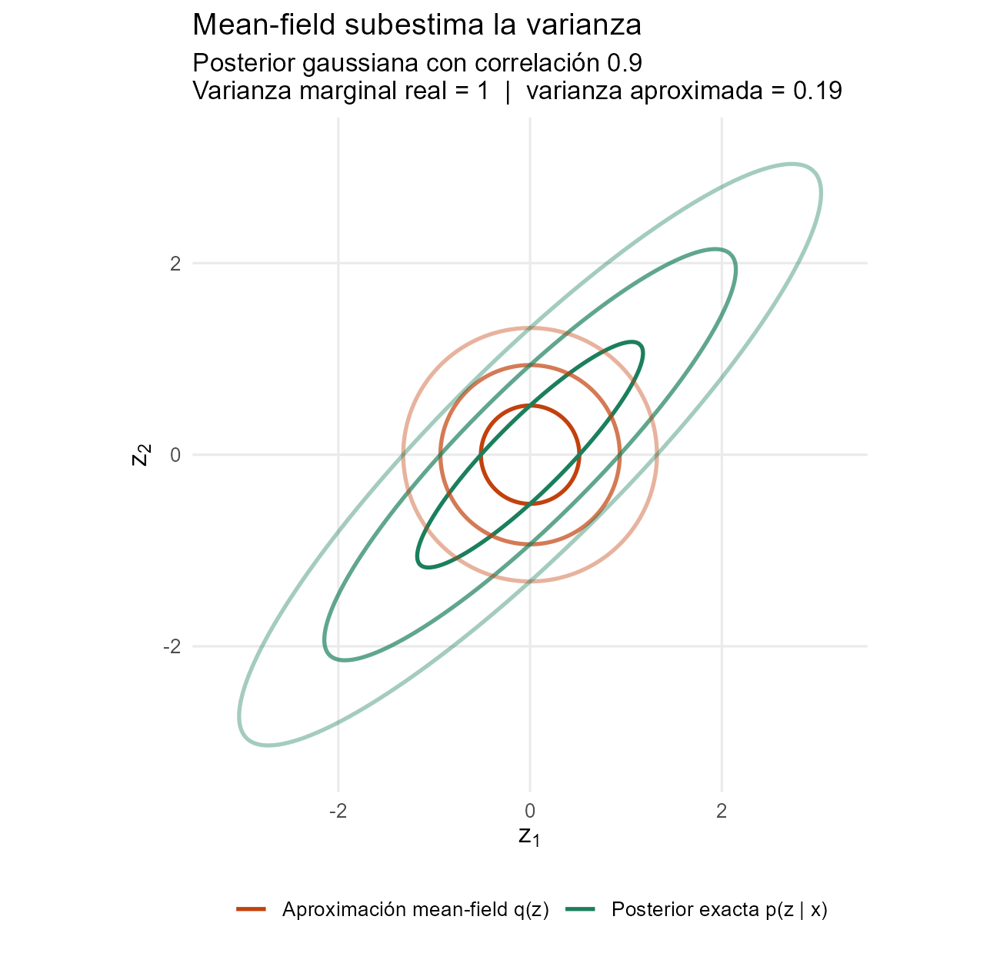
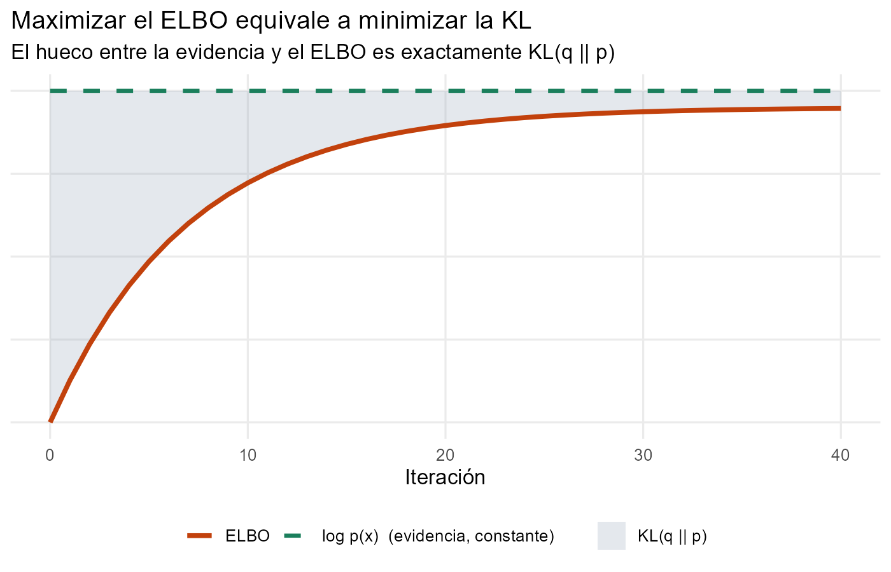
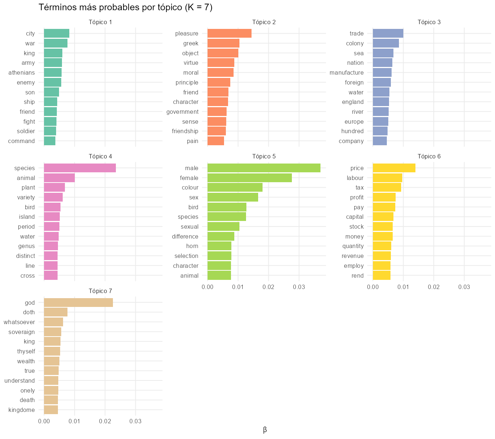
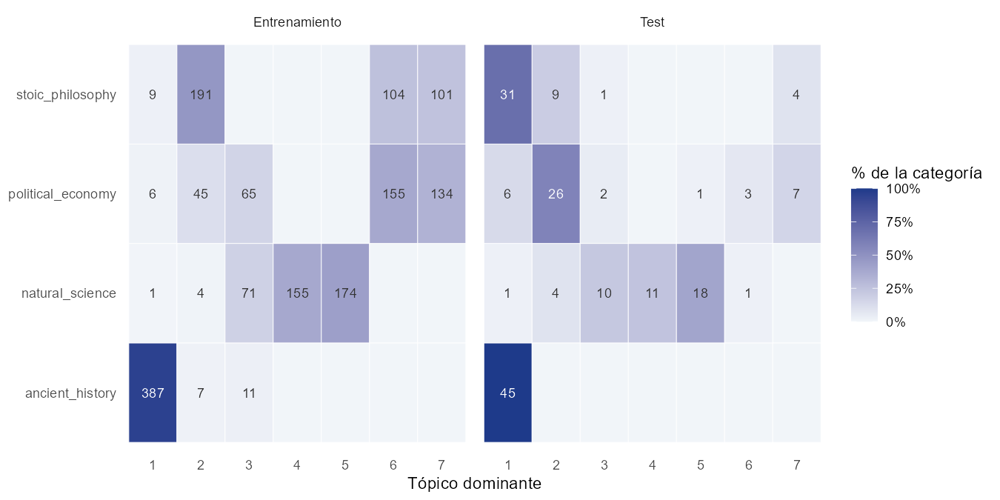

# Inferencia Variacional

**De los fundamentos (ELBO, CAVI) a la inferencia variacional estocástica y de caja negra, con una aplicación a modelado de tópicos mediante LDA en R.**

[](https://www.r-project.org/)
[](https://rmarkdown.rstudio.com/)
[](LICENSE)

📄 **[Leer el documento completo (PDF)](docs/inferencia-variacional.pdf)**

---

## Resumen

La inferencia variacional (VI) sustituye el cálculo de una distribución a posteriori intratable por un problema de optimización: se busca, dentro de una familia de distribuciones manejable, la más próxima a la posterior en divergencia de Kullback-Leibler. Es la técnica que hay detrás del modelado de tópicos a gran escala, de los autoencoders variacionales y de los lenguajes de programación probabilística modernos.

Este repositorio contiene un documento técnico reproducible que:

1. **Desarrolla la teoría**: divergencia KL, derivación del ELBO, familia de campo medio y el algoritmo CAVI.
2. **La especializa** a modelos conjugados de la familia exponencial con estructura local/global.
3. **Presenta las extensiones que la hacen escalable y genérica**: *Stochastic Variational Inference* (gradiente natural + optimización estocástica) y *Black Box Variational Inference* (gradientes Monte Carlo con función *score* y reducción de varianza).
4. **La aplica** a un problema real: modelado de tópicos con *Latent Dirichlet Allocation* ajustado por EM variacional sobre 1 800 fragmentos de obras clásicas, con selección de hiperparámetros fuera de muestra y evaluación frente a las categorías reales.

## Resultados destacados

<p align="center">
  
  &nbsp;
  
</p>

**Teoría.** Las figuras ilustran los dos resultados centrales: la aproximación de campo medio que minimiza KL(q‖p) acierta en la media pero subestima la varianza (0.19 frente a 1 con correlación 0.9), y maximizar el ELBO equivale a cerrar el hueco con la log-evidencia.

**Caso práctico: LDA sobre 1 800 fragmentos de 20 obras clásicas.**

| | Entrenamiento | Test (obras no vistas) |
|---|:---:|:---:|
| Documentos | 1 620 | 180 |
| Perplejidad (K = 7) | 1 522 | 2 947 |
| Pureza tópico → categoría | **78 %** | **57 %** |
| NMI | 0.58 | 0.44 |

<p align="center">
  
</p>

- Se descubren sin supervisión tópicos claramente interpretables: **historia militar**, **ética**, **comercio y geografía**, **variación de especies**, **selección sexual** y **economía**.
- La evaluación sobre autores no vistos es perfecta en historia antigua (45/45 fragmentos) y buena en ciencias naturales. Revela además una limitación real de LDA: uno de los tópicos agrupa *Leviatán* y las *Meditaciones* por su **registro arcaico** (*doth*, *thyself*, *soveraign*) y no por su contenido.

<p align="center">
  
</p>

## Estructura del repositorio

```
.
├── inferencia-variacional.Rmd   # Documento fuente (teoría + código del caso práctico)
├── docs/
│   └── inferencia-variacional.pdf
├── data/
│   ├── train.csv                # 1 620 fragmentos de 12 obras
│   └── test.csv                 # 180 fragmentos de 8 obras distintas
├── R/
│   └── generar_figuras.R        # Figuras conceptuales de la parte teórica
├── results/                     # Métricas de la búsqueda de K y modelo final (caché)
└── figures/                     # Figuras generadas
```

## Contenido

| Sección | Temas |
|---|---|
| **1. Introducción** | Intratabilidad de la evidencia, MCMC frente a VI |
| **2. Fundamentos** | Divergencia KL y su asimetría, ELBO, campo medio, CAVI |
| **3. Familia exponencial** | Conjugación, estructura local/global, actualizaciones en forma cerrada |
| **4. SVI** | Estimadores insesgados por submuestreo, gradiente natural, condiciones de Robbins-Monro |
| **5. BBVI** | Estimador de función *score*, variables de control, Rao-Blackwellización |
| **6. Caso práctico: LDA** | Preprocesado, selección de *K* por perplejidad, interpretación y evaluación de tópicos |

## Datos

Fragmentos en inglés de obras de dominio público de [Project Gutenberg](https://www.gutenberg.org/) en cuatro categorías: `ancient_history`, `natural_science`, `political_economy` y `stoic_philosophy`. **Las obras de entrenamiento y de test son distintas** (p. ej., Adam Smith y Hobbes en entrenamiento; Rousseau y Locke en test), de modo que la evaluación mide la generalización a autores no vistos.

| Columna | Descripción |
|---|---|
| `id` | Identificador del fragmento |
| `topic` | Categoría temática (solo se usa para evaluar) |
| `book` | Obra de origen |
| `text` | Texto del fragmento |

## Reproducir el análisis

Requisitos: R ≥ 4.3, [Pandoc](https://pandoc.org/) (incluido con RStudio) y una distribución de LaTeX (TinyTeX, MiKTeX o TeX Live).

```r
install.packages(c(
  "rmarkdown", "knitr", "dplyr", "tidyr", "tibble", "stringr",
  "ggplot2", "tidytext", "textstem", "topicmodels", "ellipse", "scales"
))
```

Desde la raíz del repositorio:

```bash
Rscript R/generar_figuras.R
Rscript -e 'rmarkdown::render("inferencia-variacional.Rmd")'
mv inferencia-variacional.pdf docs/
```

El renderizado utiliza los resultados guardados en `results/` y tarda menos de un minuto. Para reentrenar desde cero, borra esa carpeta: la búsqueda de *K* (19 modelos LDA) se ejecuta en paralelo y tarda unos 20 minutos con 12 núcleos. Todas las semillas están fijadas.

## Referencias principales

- Blei, D. M., Kucukelbir, A. y McAuliffe, J. D. (2017). *Variational inference: A review for statisticians*. JASA.
- Blei, D. M., Ng, A. Y. y Jordan, M. I. (2003). *Latent Dirichlet allocation*. JMLR.
- Hoffman, M. D., Blei, D. M., Wang, C. y Paisley, J. (2013). *Stochastic variational inference*. JMLR.
- Ranganath, R., Gerrish, S. y Blei, D. M. (2014). *Black box variational inference*. AISTATS.

La bibliografía completa está al final del documento.

## Autores

- **Nolhan Denis Alonso Guignon**: [@NolhanAlonsoGuignon](https://github.com/NolhanAlonsoGuignon)
- **Ismael Amador García**

## Licencia

Distribuido bajo licencia MIT. Consulta [LICENSE](LICENSE).
